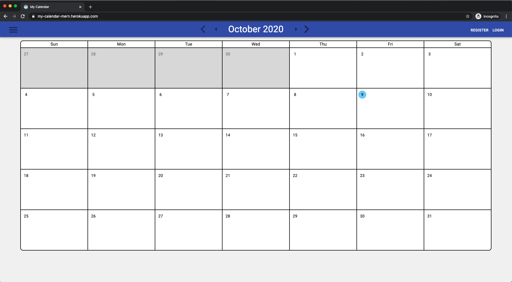

# Welcome
Hello and thank you for checking out my project!
This project is up on https://my-calendar-mern.herokuapp.com/
(May take up to 5 seconds to load as heroku "sleeps" applcations)

This application was created using the MERN stack (MongoDB, Express, React/Redux, and Node).
This project is still ongoing, weather information for a particular day coming soon...

## Running Locally
Please follow the steps in order to run this project locally:

### Set up MongoDB
1. Create an account at https://account.mongodb.com/account/login
2. Click "Create a new Cluster" and follow along the instuctions
3. Click "Connect" on your newly created cluster then the "Connect your application" option
4. Copy the connection string and set that equal to SERVER_KEY in .env-template

### Cloning and Installing Dependencies
1. Clone this repository. e.g. `git clone git@github.com:nksiu/calendar-app.git` in your terminal
2. Run `npm i`
3. Run `npm i --prefix frontend` 
4. Find the .env-template file and assign values to the keys.
5. Rename the .env-template file to .env
6. Run `npm run dev`
7. If no tab pops up automatically, navigate to http://localhost:3000/

Congratulations, you have succesfully setup this application locally!